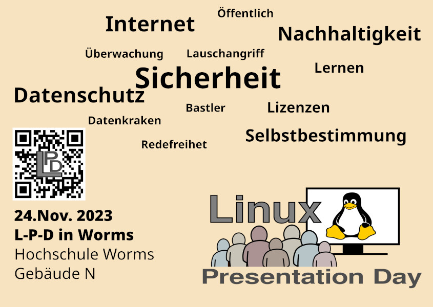
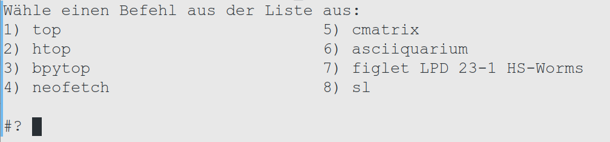
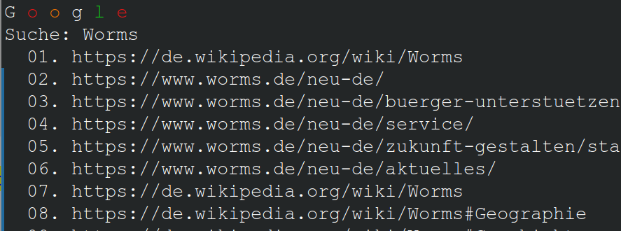

**Bash einfach**  
Angelegt Donnerstag 23 November 2023

# LPD 23-2 in Worms

  

  
  

**Stefan Höhn Wormser Linux User Stammtisch Wolust**  

  

Mir gehts mehr um die Möglichkeiten  
… Spass am tun 🤗️  
als um eine korrekte Definition.  
Schule, Prüfung …

  

Glederung: Philosophisches. Lustiges, Eigenes

  

## Was ist Bash? Unterschied zu Fensterprogrammen.

**Bourne again Shell**  
  
Mensch-Maschine Schnittstelle . Human Machine Interface“ (HMI)  
Befehl an Maschine-\> Ausgabe (auch Computerprogramm)

  

**Das braucht man für BASH:**  
Kleines schwarzes Kästchen -\> Dosfenster -\> Terminalemulator -\>
Terminal  
Es gibt verschiedene Shells : zsh, csh, fish ………Powershell ?  
Hier gehts um BASH … Vorteile …

  

<u>echo \$0</u> \# welche Shell  
<u>bash --version</u> \#Version

  
  

### Unterschied zum Fensterprogramm

Viele Newbies halten das für **Nachteil** Mausanwendungen sind sehr
eingeschänkt 🐭️❌️  
**Vorteil** : Ich mach mir meine (Welt) Ausgabe wie sie mir gefällt, mit
wenigen Befehlen. 🌍️  
ls, cd, cat ,nano, man …

  

### Hallo Welt

**Philosophisches … existentielles**  
\## Hallo Welt  
<u>echo "Hallo Welt!"</u>

  

\## Windows ~ "Explorer"  
echo "Wo bin ich als Variable? "; <u>\$(pwd)</u> ;ls \# oder als
Kommando: pwd

  

\## Windows ~ Explorer Meine Dateien  
echo "ich will nach Hause ! "; <u>cd ;</u>ls

  

\## Windows ~ Laufwerk C:  
echo "ich will ganz an den Anfang!" <u>;cd / ;ranger</u>

  

echo "wer bin ich?"; <u>whoami</u>

  

echo "in was für einer Welt (BS) bin ich gerade?"; <u>uname</u>

  

echo "was für Datum?"; <u>date</u>

  

echo "starte Firefox Browser" ; <u>firefox
<a href="https://wolust.de" class="https"
title="https://wolust.de">https://wolust.de</a></u>

  

echo " töte Firefox"; <u>killall -9 firefox</u>

  

echo "welche Programme laufen gerade?"; <u>ps</u>

  

### Einfache Befehle mit Action und Bunt

**KI ? Ja , Bing-Chat macht auch Bash**

  

Mein Prompt :  
Mach mir eine Liste mit Bashkommandos die bei einer
Einführungsveranstaltung für Linuxneulinge Eindruck erwecken !  
Sie sollen eine grafische Ausgabe haben und vielleicht auch mehrfarbig.
Beispiel :ponysay, lolcat,htop,hollywood  
Mach mir ein Menue in Bash mit dem ich diese Kommandos der Reihe nach
starten kann.

  

  
Ergebnis:  
[bash-menue](bash-menue.sh)

  

### Was ist mit hollywood ?

<u>systemctl start docker</u>  
<u>docker run --rm -it bcbcarl/hollywood</u>

  

### Ein Bash-Script von mir

Google Suche (6 Zeilen Bash)  
  
<a href="https://gist.github.com/dewomser/aa12dff5724d12fa1e24b94251e785fe" class="file"
title="~/bin/googlesuche.sh">googlesuche.sh</a>

  

Danke fürs zugucken !

  

Fragen? Folien?

------------------------------------------------------------------------

  

<a href="https://devhints.io/bash" class="https"
title="https://devhints.io/bash">https://devhints.io/bash</a> Übersicht
Modernes Bash  
<a href="https://www.shellcheck.net/" class="https"
title="https://www.shellcheck.net/">https://www.shellcheck.net/</a> Code
Überprüfen, Syntax  
<a href="https://gist.github.com/dewomser" class="https"
title="https://gist.github.com/dewomser">https://gist.github.com/dewomser</a>
72 kurze Bashcripts von mir

  

Und natürlich gibts auch ein kommando zum erzeugen des QR-Codes  
<u>qrencode -s 15 -o wolust.png
<a href="https://www.wolust.de" class="https"
title="https://www.wolust.de">https://www.wolust.de</a></u>  
  
<a href="https://wolust.de/" class="https"
title="https://wolust.de/">https://wolust.de/</a> Wormser Linuxuser
Stammtisch

### Nächster Linuxstammtisch in Worms ist am 05.12.2023

  
  
  
  
  
